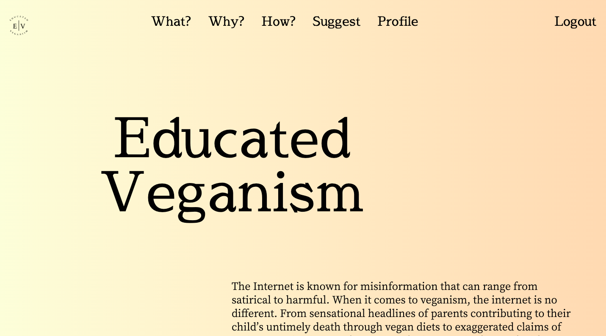
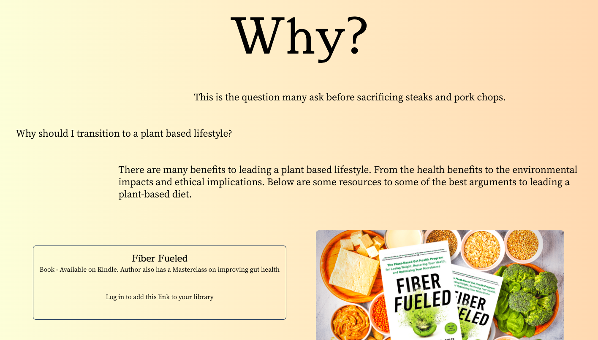
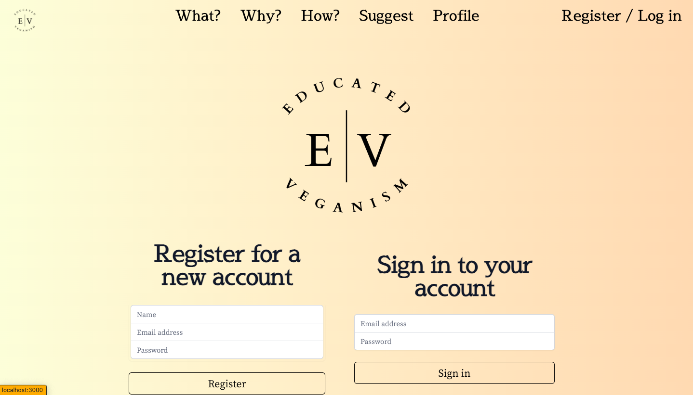
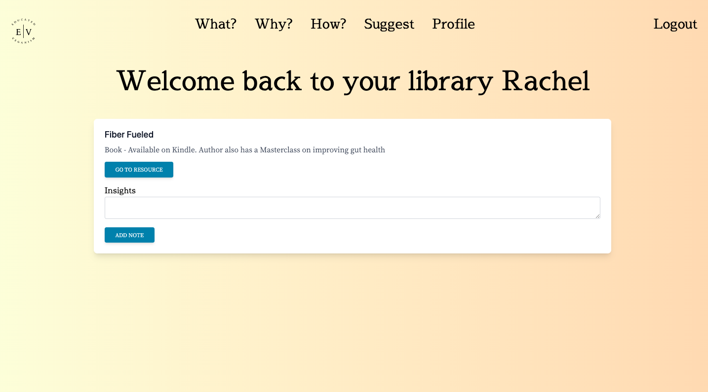

# Educated-Veganism

## Description 

Veganism is a growing trend in the United States. Despite its growing popularity, many resources regarding veganism are extreme, biased and factually incorrect. It can be difficult to find credible information regarding veganism. This web application is a library of vegan resources which are categorized into the different questions one might have regarding veganism. What is veganism? Why consider a plant based lifestyle? How does one live a plant based life? The web application is intentionally left private to allow the user to explore veganism without the judgement from the internet. 

## Installation 

Use the link below to access the web application. 

https://young-everglades-48609.herokuapp.com/

## Usage 

The user will first be taken to the homepage. 

 
 

The user can access the library of resources that are categorized by the links at the top of the webpage. If the user is not logged in, the resources can still be accessed but the user will not be able to add a resource to thier library.

 

When the user clicks on the profile page, they will be redirected to the login/registration page.

 

When the user logs in or registers, the user will be redirected to the homepage. When the user navigates the resources, the user is able to add resources to thier library. 

 

When a logged in user navigates to their profile, they can access their library and add notes to the resources. 

 

## Credits 

Starter code was used for the server.
 I used a third party website to create the Logo. 
 Meg Meyers contributed to troubleshooting my application. 
EmailJS was used to add functionality to the suggestions page. 
Framer motion was used to add animations to the webpages 

## License 

MIT License

Copyright (c) [2022] [AlejandraQuintero]

Permission is hereby granted, free of charge, to any person obtaining a copy of this software and associated documentation files (the "Software"), to deal in the Software without restriction, including without limitation the rights to use, copy, modify, merge, publish, distribute, sublicense, and/or sell copies of the Software, and to permit persons to whom the Software is furnished to do so, subject to the following conditions:

The above copyright notice and this permission notice shall be included in all copies or substantial portions of the Software.

THE SOFTWARE IS PROVIDED "AS IS", WITHOUT WARRANTY OF ANY KIND, EXPRESS OR IMPLIED, INCLUDING BUT NOT LIMITED TO THE WARRANTIES OF MERCHANTABILITY, FITNESS FOR A PARTICULAR PURPOSE AND NONINFRINGEMENT. IN NO EVENT SHALL THE AUTHORS OR COPYRIGHT HOLDERS BE LIABLE FOR ANY CLAIM, DAMAGES OR OTHER LIABILITY, WHETHER IN AN ACTION OF CONTRACT, TORT OR OTHERWISE, ARISING FROM, OUT OF OR IN CONNECTION WITH THE SOFTWARE OR THE USE OR OTHER DEALINGS IN THE SOFTWARE.